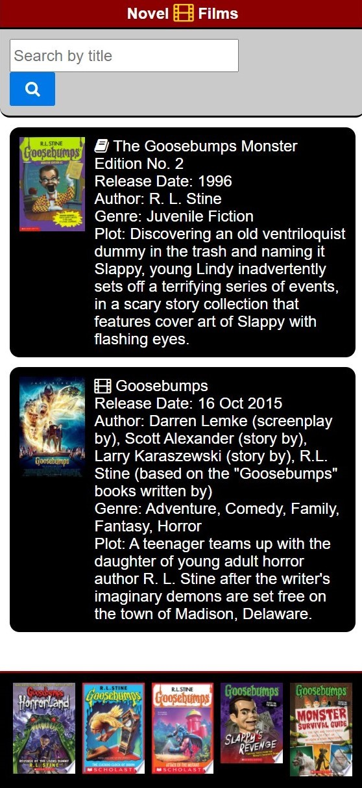

# NovelFilms Project
## Description
The purpose of this project is to create a mobile-first dashboard application that pulls from multiple APIs to display books and a related movie based on user search input. 
<!-- more thoughts on purpose here -->

**First Release**: `2020 October 09`
 
Deployed at: https://cete4.github.io/NovelFilms/
 
Respository: https://github.com/cete4/NovelFilms

### Team Members
* Micah BigEagle
* Josh Thorngren
* Charline Lach

## Functionality
<!-- Upon application load, the user will be presented with a number of inputs options to request information from multiple APIs regarding books and their related films. Upon completing a search, the user will be presented with a nunber of results based on their input. Upon revisiting the app, the user will be presented with their previous searc results. The app will also include a trending section if fuinctionally possible.  -->

Upon application load, the user will be presented with a search field and results from the last search, if applicable. The data will be gathered from multiple APIs. Data for one book and for one film will appear in the main, mid-page search. For further book options, they may appear in the footer section of the page. The footer only shows results from the most recent search.

## Installation
This application will work via local storage.

## License